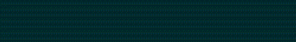
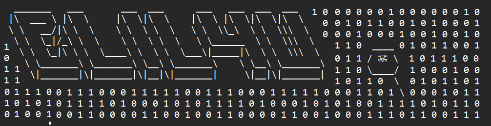

<table>
  <tr>
    <td align="left">
       
    </td>
    <td align="right">
      <h1 align="center">🕵️‍♀️ Hi there, I'm Eli (pronounced 'Eh-lee', like in Spanish, not 'Elai'😉) 👾</h1>
    </td>
  </tr>
</table>

  

<h2 align="center">🎯 Exploit | 📋 Report | 🔐 Secure." 
  💬 "Ethical hacking is not a crime – it's a responsibility"
</h2>

<h3 align="center">Cybersecurity Specialist & Penetration Tester | OSINT Investigator | Aspiring Bug Bounty Hunter</h3>

**🎯 Looking for:** Cybersecurity Analyst · Junior Pentester · OSINT Analyst 
**📍 Status: ✅** Available · Open to Work  
**🛠️ Skills:** Vulnerability Analysis · Web Security · Ethical Hacking · Open Source Intelligence · Bug Hunting

---

## 🏅 My Certificates and Badges

---

## ⚙️ Study Platforms

- 🏴 Web Security Academy (PortSwigger)
- 💪 TryHackMe
- 📦 HackTheBox

---

## 🚀 Current Projects

- 🕷️ **Bug Bounty Journey** – A structured roadmap documenting my hands-on journey to become a Bug Bounty Hunter.
- 📁 **Portfolio** – A collection of my cybersecurity and tech projects.

---

## 📚 Education

- 🌱 I’m currently studying **IFCT0109 - Computer Security** (500h, IronHack, Official Level 3/C Professional Certificate, 2025).
- 🎓 BTEC L4 Higher National Certificate in Computing (MSMK University, 2024)
- 📜 Cybersecurity Bootcamp (360h, The Bridge | Digital TalentAccelerator, 2024)
    

      
🔐 MODULE 1 - Fundamentals of Security and Systems:

      
      - Bash scripts for task automation.
      - HTML and JavaScript.
      - Network packet analysis.
      - OSI model.
      - Cryptographic protocols.
      - Pentesting and vulnerability analysis.
      - Python scripts.
    

    

      
🚩 MODULE 2 - Offensive Security / Red Team:

      
      - Internal and external audits.
      - Creating technical reports and identifying risks.
      - Developing cybersecurity projects.
      - Monitoring of network security and testing.
      - Vulnerability assessments and risk analysis.
      - Best practices.
    

    

      
🛡️ MODULE 3 - Defensive Security / Blue Team:

      
      - Security risks and protecting of assets.
      - Forensic analysis reports.
      - Detecting threats and cyberattacks.
      - Monitoring network security (software, firewalls, encryption).
      - SIEM systems.
    

  
  #### 🔧 **TOOLS**
      

     

     

---

---

## 📫 Connect with me:

💬 Feel free to ask me about **anything on a professional level.**

---
<h3 align="left">Languages and Tools:</h3>

                                

&nbsp;

  

